# Containerization technology Pt2: Kubernetes

# What is kubernetes?

Docker or containerization have brought up a fascinating solution for deploy and managing software using microservice architect. But when the solution became more and more global there go a problem. If the software contains a huge number of services required the same number of containers, how do developers or administrators monitor it effectively, from hardware consuming to response speed, load balancing and more. This is container orchestration platform like kubernetes demonstrates themselves. 

Kubernetes is a open source platform developed by Google engineers firstly introduced in 2014. It provides a solution for developers to manage, scale and deploy their containerized product more efficiently and simply.

# Kubernetes Architecture

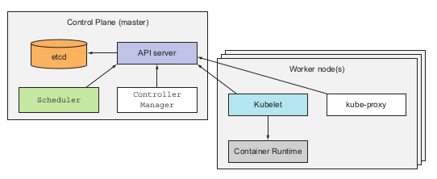

When working with kubernetes you will encounter with these below basic components:

- **Cluster**: the first objects created when you run kubernetes, basically cluster is the thing that contains all of your kubernetes services inside.
- **Nodes:** Inside the cluster, developers will have the nodes, The nodes are place that tore and actual run the containerized application. There are 2 types of nodes in kubernetes architecture, master nodes and worker nodes
    - **Master nodes:** The master nodes contains and runs the kubernetes Control Plane, which provides the manager, monitor for the whole cluster.
    - **Worker nodes:** The worker nodes are the place where actual containerized applications is hosted. It contains services like kubelet, kube-proxy and container-runtime in order to communicate with the master nodes and run application properly

Take a closer look on the compounds of 2 type of nodes developers will have:

- For the master node:
    - The Kubernetes API Server: This manage the API and the API object version of each application you deploy inside the cluster. These objects including pods, services, replicaSets, and more.
    - The scheduler: this will did as exactly as its name, it schedule your application, which means it assigns the worker nodes to each newly deploy-able component of your application
    - *kube control-manager*: This components is in charge of monitor and run the controller processes. In kubernetes, all controllers are combined in one process to reduce complexity. Some controller services are: node controller, job controller, endoint controller and service account and token controller.
    - *etcd*: this component will store all the cluster data as backing store.
- For the worker node:
    - *kubelet:* This components run on each nodes of the cluster in order to make sure that every images running inside the pod. It takes the PodSpec from various mechanism and make sure that each container specified in side PodSpec is running healthy.
    - *kube-proxy*: this is a network proxy that run on each node of the cluster. This maintains the network rules of the node, which allow network communications to the pods inside or outside the network cluster.
    - *Container-runtime*: This simple is in charge of running container inside your nodes. Kubernetes support multiple container runtime such as: Docker, Containerd, CRI-O...etc (Docker is projected to be removed from kubernetes container-runtime at late of 2021 per kubernetes.io)

# Kubernetes core concepts

When working with kubernetes, there are some core concepts or keywords that developers should memorize in order to fully understand the architecture and the mechanism of this container orchestration.

## Pods

The first concept  is the concept of pods. Pods basically is the place to store and run the containers. Each pod created and run on only one nodes of the cluster, and normally each pods should contains a single containers which in charge of one processes of the application. It will remains the isolated feature of our microservices application and function more efficient. 

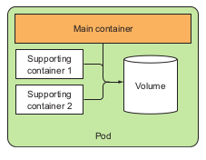

The image above demonstrated an ideal components of a pod. The containers inside the pod should be organized in such way that they support each other and is expected to full-fill one specific processes.

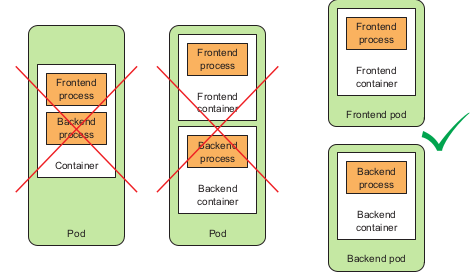

This image above demonstrated when developers should group the containers in one pod and when developers should separated them so that it will optimized their function.

### 1. Pods deep dive

As mention above, pods are a higher level construct compared to containers in order to group the related containers and manage them as a single unit. A pod with related containers allow you to run closely related process and provide them with almost the same hardware and OS requirements while keeping these containers isolated. 

**→ Partial isolation behind pods**

Containers inside pods to some extends is not fully isolated to one another. However containers are designed to be fully isolated. Therefore, Kubernetes has configuring containers inside a pod so that they share the same set of *linux namespace* instead of each containers has its own namespace. 

For containers inside a pod, they will run under the same Network and Unix Time Sharing (UTS) namespace, so they will share the same hostname and network interfaces. Similarly when containers run under the same Network and Inter-Process Communication (IPC) namespace can communicate through IPC. (UTS and IPC are two of Linux namespace kinds). However, the filessystem work a little bit different for these partly isolated issues. The filesystem of a container comes from the image and it is of course fully isolated from other containers, so two configuring them to be sharable between containers, Kubernetes utilized the *volume* concept, which will be discussed later.

→ **Flat** **Inter-pods network** 

All pods in Kubernetes cluster reside in a single flat, shared network-address space, which allows every pods to connect to one another through the IP address of the destination pod, no Network Address Translation gateway existed between pods. So when 2 pods sends network packages to one another, they'll each see the actual IP address of the other pods as the source IP address in the packages.

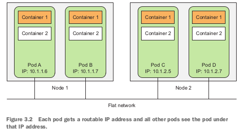

This architecture makes communication between multiple pods always simple. It's unnecessary to know if 2 pods are scheduled onto a single or onto different worker nodes.  In both case the containers inside those 2 pods can always communicate through this flat NAT-less network, this much like the computers on Local Area Network. 

 Summary: "Pods are logical host and behave much like physical hosts or VMs in the non-container world. Processes running in the same pod are like processes running on the same physical or virtual machine, except that each process is encapsulated in each container." - Marko Luska, *Kubernetes in Action* 1st edition, 2019

### 2. Pod description and creation

The pods can be created by posting a YAML or JSON file to the Kubernetes API endpoint, or developers can use the kubectl run to created a pod. 

A pod information can be shown in YAML file like::

```yaml
$ kubectl get po kubia-zxzij -o yaml
apiVersion: v1
kind: Pod
metadata:
	annotations:
		kubernetes.io/created-by: ...
	creationTimestamp: 2016-03-18T12:37:50Z
	generateName: kubia 
	labels: 
		run: kubia
	name: kubia-zxzij
	namespace: default
	resourceVersion: "294"
	selfLink: /api/v1/namespaces/default/pods/kubia-zxzij
	uid: 3a564dc0-ed06-11e5-ba3b-42010af00004
spec:
	containers:
	- image: luska/kubia
	imagePullPolicy: IfNotPresent
	name: kubia
	ports:
	- containerPort: 8080,
		protocol: TCP
		resources:
			requests:
				cpu: 100m
	terminationMessagePath: /dev/termination-log
	volumeMounts:
	- mountPath: /var/run/secrets/k8s.io/servacc
	name: default-token-kvcqa
	readOnly: true
	dnsPolicy: ClusterFirst
	nodeName: gke-kubia-e8fe08b8-node-txje
	restartPolicy: Always
	serviceAccount: default
	serviceAccountName: default
	terminationGracePeriodSeconds: 30
	volumes:
	- name: default-token-kvcqa
	secret:
	secretName: default-token-kvcqa
status:
	conditions:
	- lastProbeTime: null
		lastTransitionTime: null
		status: "True"
		type: Ready
	containerStatuses:
	- containerID: docker://f0276994322d247ba...
		image: luksa/kubia
		imageID: docker://4c325bcc6b40c110226b89fe...
		lastState: {}
		name: kubia
		ready: true
		restartCount: 0
		state:
			running:
			startedAt: 2016-03-18T12:46:05Z
	hostIP: 10.132.0.4
	phase: Running
	podIP: 10.0.2.3
	startTime: 2016-03-18T12:44:32Z
```

By breaking down the above pods definition developers may have several parts:

- Kubernetes API version
- type to describe: in this part which is pods
- Metadata: includes information about the pods such as name, namespace, labels, which categorized and specified the pods
- spec: contains the description for pods contents such as container description, volumes, port
- status: contains the current state of the running pod, including conditios, container info, basic IP and other info

From the above description developers can create a YAML file descriptor for a new pod such as: 

```yaml
apiVersion: v1
kind: Pod
metadata:
	name: kubia-manual
spec:
	containers:
	- image: luksa/kubia
	name: kubia
	ports:
	- containerPort: 8080
	protocol: TCP
```

### 3. Labels

Label is a mechanism in Kubernetes referred to the act of choosing the specific type of nodes based on their hardware, CPU, GPU...etc that one specific pod should run on. By using label and label selector, developers may give Kubernetes a method to schedule pod running on their desired hardware in order to optimized the pod production. This however will group the pods which share the same labels. 

→ **Label definition** 

A label is an arbitrary key-value pair that developers attach to the components inside the clusters. This key-value pair later on is used for selecting components through label-selector mechanism. A resource can have multiple label, provided that the keys of those labels are unique inside that resource.  

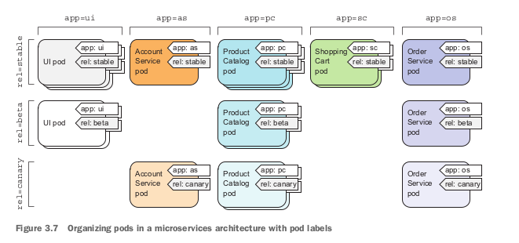

→ **Label operation on pods** 

- **Specify Label when creating pod through YAML file**

    ```yaml
    apiVersion: v1
    kind: Pod
    metadata:
    	name: kubia-manual-v2
    	labels: 
    		creation_method: manual
    		env: prod
    spec:
    	containers:
    	- images: luska/kubia
    		name: kubia
    		ports: 
    		- containerPort: 8080
    			protocol: TCP
    ```

    To see the pods with label: 

    ```yaml
    $ kubectl get po --show-labels
    ```

- **Modifying label of existing pods**

    ```yaml
    $ kubectl label po kubia-manual creation_method=manual
    ```

    When developers want to modify a existing label:

    ```yaml
    $ kubectl label pod kubia-manual env=debug --overwrite
    ```

- **Listing resources through label selector**

    By using this command we're able to list all pods with specific label:

    ```yaml
    kubectl get po -l label_key
    ```

    If developers would like to list the pods with specific value of label:

    ```yaml
    kubectl get po -l label_key=value
    ```

    → **Using label and selectors to constrain pod scheduling**

    As of Kubernetes cluster, all pods will be scheduled randomly across the worker nodes. However, there are some specific cases when developers would like to take over and schedule there pods manually across the nodes, *label* and *node selectors* would support this scenario. 

    The idea is not to tell the cluster exactly where to schedule your pods, since you want to hide your infrastructure as much as you can, but to tell the clusters what type of node should this pods be scheduled to, and let Kubernetes done the rest for you. 

    → **Using label to categorize your worker nodes**

    Label isn't only for categorizing your pods but also other resources including nodes, when you or Ops team add a new node to the cluster, You should use labels to categorize that node based on their hardware or features. For example:

    ```yaml
    kubectl label node gke-kubia-85f6-node-0rxx gpu=true
    ```

    As you can see the constraint for kubectl command to add label to a nodes is the same as when you add to the pods. In the command above developers add label gpu with value true to the node named gke-kubia-85f6-node-0rxx, which define that this node has GPU. 

    → **Using node selectors to schedule pods**

    After define node type as above, developers are able to use node selectors to schedule our pods as follows:

    ```yaml
    apiVersion: v1
    kind: Pod
    metadata:
    	name: kubia-gpu
    spec:
    	nodeSelector:
    		gpu: "true"
    	containers:
    	- image: luksa/kubia
    		name: kubia
    ```

    Inside spec field developers define the nodeSelector with gpu is true, which means that the node used to scheduled for this pod is required gpu.

### 2. Namespaces

Namespaces in Kubernetes is a mechanism for dividing the objects and pods into separated groups without overlapping like when using labels. And this mechanism allows you to reuse the name of a pod or object.

→ **Creating namespace**:

Developers create a custom namespace through YAML file:

```yaml
my_namespace.yml

apiVersion: v1
kind: Namespace
metadata:
	name: my_namespace
```

then use kubectl to post this file to the server:

```yaml
kubectl create -f mu_namespace.yml 
```

To list the pods with their corresponding namespace:

```yaml
kubectl get po --namespace 
```

To get every namespace inside the cluster:

```yaml
kubectl get ns
```

### Stop or removing pods

→ delete by name:

```yaml
kubectl delete po po_name
```

→ using label selectors:

```yaml
kubectl delete po -l {label_key}={label_val}
```

## Replication and controllers: how to manage pods

In Kubernetes, the replica is a copy of a pods during runtime. When developers run a pod  called pod A, a Replication Controller will be created in order to monitor the pod running. If for any reason the pod is missed or malfunctioned, or the node that pod is running in malfunction, this controller will start directed to another available node inside the cluster and created a replica of pod A called pod A2.

### 1. Pod management

When a pod is assigned to a working node → the *kubelet* component of that node will run its container as long as the pod exists. 

If container main process crashed → *kubelet* restart the container.

Sometimes the container stop working without crashing,, e.g memory leak *OutOfMemory* in Java or infinite loop, deadlock for Database → Need a mechanism to check the health of container in Kubernetes.

→ **Liveness probes**

Set of mechanisms in Kubernetes allowed the node to check the health of the container periodically. There are 3 mechanisms used:

- HTTP GET probe: performs a HTTP GET request to container's IP address, pods and path specified by developers → receive non-error responses → find → else failed and need to be restarted.
- *TCP socket* probe: open a TCP connection to the specified port of container → connected successfully → find → else failed.
- *Exec* probe: executes arbitrary commands inside the container and check the exit status → 0 is fined → others failed.

→ E.g: **HTTP liveness probes**

This should be used for web apps or web server application. For example take a look at Nodejs pod specification:

```yaml
apiVersion: v1
kind: pod
metadata:
	name: kubia-liveness
spec:
	containers:
	- image: luksa/kubia-unhealthy
		name: kubia
	livenessProbe:
		httpGet:
		path: /
		port: 8080
```

inside spec field of the pod specification developers defined a l*ivenessProbe* with a *httpGet* request to the path / specified inside the app at port 8080 of the container. If this request receive a 2xx or 3xx status code responses it will be considered fine, else it is failed and the container should be restarted.

In order to check the health of a pod, developers can use the commands:

```yaml
kubectl describe po {po_name}
```

→ **Create an effective liveness probe**

- Choose right feature to check by liveness probe
- Keep liveness probe light
- don't need to implement re-try loop in probes

### Replication Controller

An mechanism that ensures the continuous running of a pod, no matters what accidentally happens to that pod or even the node that pod is currently scheduled. 

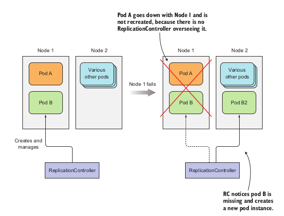

Also ReplicationController will maintain the desired amount of a pod running inside the cluster → if too few it will add more. If too much it will delete. Such operation is perform as follow::

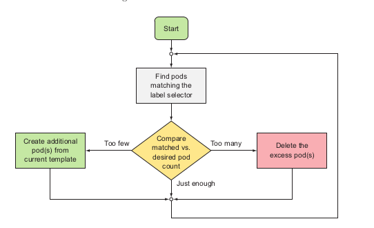

→ ReplicationController components:

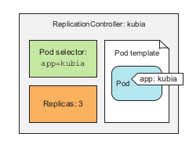

- *label selector*: determines which pods are in replication controller scope
- *replicas*: desired amount of pod replicas inside the cluster
- *pod template*: desired architecture of replicas

→ Creating replication controller:

```yaml
### controller/replication.yaml
apiVersion: v1
kind: ReplicationController
metadata:
  name: nginx
spec:
  replicas: 3
  selector:
    app: nginx
  template:
    metadata:
      name: nginx
      labels:
        app: nginx
    spec:
      containers:
      - name: nginx
        image: nginx
        ports:
        - containerPort: 80
```

 to post the file to the server:

```bash
$ kubectl create -f replication.yaml
```

To get the all replication controllers 

```bash
$ kubectl get rc
```

To get information of replication controller:

```bash
$ kubectl describe rc {replicationController_name}sascs
```

→ Manage pods inside replication controller

To remove a pods from replication controller: remove or change their label selector defined inside replication controller

**Note**

Changing replication controller label selector will affect all the pods inside the controller, in this case it will removed all the pods currently inside the controller scope and create new pods that satisfy the label selector. However, developers rarely change the label selector of controller, but the pod templates.

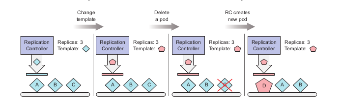

By changing the pod templates, it'll only affects the newly created pods afterwards, the old pods with old templates will not be affected. 

When delete a replication controller using:

```bash
kubectl delete rc {rc_name}
```

It will also delete the pods created with it. However if developers only want to delete the replication controller and replace it with another controller or replication set:

```bash
kubectl delete rc {rc_name} --cascade=false
```

### ReplicaSets

ReplicaSets is a newly developed mechanism to manage the pods inside the cluster and it will replace the ReplicationController soon as only mechanism. 

Different from the ReplicationController, ReplicaSets manage the pods not only by one specific label selector and values, but label selector regardless of the values

```yaml
### controller/replicasets.yml
apiVersion: apps/v1
kind: ReplicaSet
metadata:
  name: kubia
spec:
  replicas: 3
  selector:
    matchExpressions:
      - key: app
	operator: {Op_option}
	values: 
	  - kubia
  template:
    metadata:
      labels:
        app: kubia
    spec:
      containers:
      - name: kubia
        image: luksa/kubia
```

From above developers can see the *matchExpression* field is a replacement for *selector* field in *ReplicationController.*

- *key*: define the label selector to manage.
- operator: multiple options for managing pods based on key:
    - *In*: labels values must be in specified values:
    - *NotIn*: label's value not in specified value
    - *Exists*: pods must include the label selector as same as key regardless of its value
    - *DoesNotExists*: pods must include the label selector different from key regardless of its value
- values: specific values for the key.

### Daemon Sets

→ link: [https://kubernetes.io/docs/concepts/workloads/controllers/daemonset/](https://kubernetes.io/docs/concepts/workloads/controllers/daemonset/)

→ **Usage**: To ensure a pod running on every nodes or only certain nodes inside the cluster, e.g: infrastructure-related pods perform system-level process, kube-proxy process.

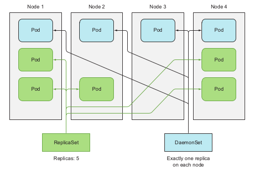

→ **Creating YAML file** : 

```yaml
### controller/ssd-monitor-daemmonset.yaml
apiVersion: apps/v1beta2
kind: DaemonSet
metadata:
  name: ssd-monitor
spec:
  selector:
    matchLabels:
      app: ssd-monitor
  template:
    metadata:
      labels:
        app: ssd-monitor
    spec:
      nodeSelector:
        disk: ssd
      containers:
      - name: main
        image: luksa/ssd-monitor
```

→ **command**

- creating through yaml file:

    ```yaml
    $ kubectl create -f {daemonset_yaml_file_name}.yaml
    ```

- get:

    ```yaml
    $ kubectl get ds
    ```

### Jobs and CronJobs

→ link: 

- Jobs: [https://kubernetes.io/docs/concepts/workloads/controllers/job/](https://kubernetes.io/docs/concepts/workloads/controllers/job/)
- CronJobs: [https://kubernetes.io/docs/concepts/workloads/controllers/cron-jobs/](https://kubernetes.io/docs/concepts/workloads/controllers/cron-jobs/)

→ **Usage**: 

- Jobs: support one-time-only running pods, when the container finished running it'll not restart.

    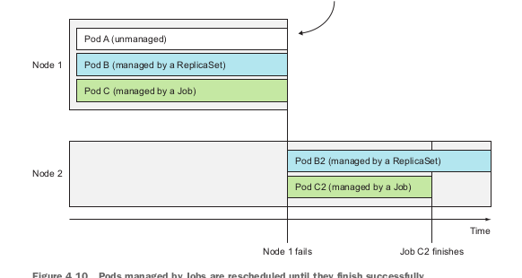

    Pods management by Job

- CronJobs: support scheduling pods periodically.

→ **Creation:**

- Jobs:

    ```yaml
    ###controllers/jobs.yml
    apiVersion: batch/v1       # Jobs belongs to batch API group, version 1
    kind: Job
    metadata:
      name: {job_name}
    spec:
      template: 
        metadata: 
          labels: 
            app: {job_name}
        spec: 
          restartPolicy: {policy_name}
          containers:
          - name: {container_name}
            image: {image_name}
    ```

    Inside the template for pods description, developers specify the restartPolicy for that pods since the Job pods cannot utilize the default policy which is Always. 

    ```yaml
    $ kubectl create -f {job_name}
    ```

- CrobJobs:

    ```yaml
    ### controllers/CronJob.yml
    apiVersion: batch/v1beta2       #CronJob belongs to batch api group, version 1 beta 2
    kind: CronJob
    metadata: 
      name: {CronJob_name}
    spec:
      schedule: "0, 15, 30, 45 * * * *"  #template: minutes_per_hour_by_colon hour day_of_month month day_of_week
      jobTemplate:
        spec: 
          template: 
    	metadata: 
    	  labels: 
    	    {label_key}: {label_value}
    	spec: 
    	  restartPolicy: {Option_not_always}
    	  containers:
    	    - name: {container_name}
    	      image: {image_name}
    ```

## Services

→ **Usage:** make an entrypoint to the group of pods provide the same service. Client connect to service through IP address and port, service will handle the pod connection part. → transparency and flexibility.

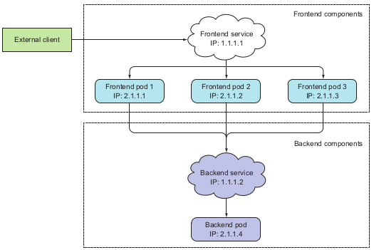

→ **Creating** **a service**:

Service manage pods through labels and label selector like other previous management mechanisms. 

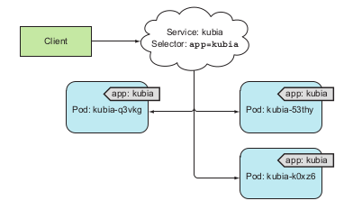

Service is created through `yaml` file and `kubectl` create commands:

```yaml
apiVersion: v1     #Service belongs to api version v1, services apps
kind: Service
metadata:
  name: {service_name}
spec:
  ports:
  - protocol: TCP
    port: 80            #port that service listen to
    targetPort: 8080    #port of container that service forward to
  selector:
    app: {label-selector}
```

Each service will be assigned with specific IP address from the cluster. This IP address is virtual and stored in the `iptables` components. `kube-proxy` will create and track this component for each services inside the cluster. When a request is post to the IP and port of a service, `kube-proxy` will listen and forward to a pod managed by that service  by round-robin algorithm.

→ **SessionAffinity**

Two types: `None` and `ClientIP` 

Usage: when developers want to redirect request from specific client IP to specific pods. 

SessionAffinity does not base on cookies since the services working at transport layer not application layer.

→ **Exposing multiple port in service**

Service support multi-port, defined in yaml file like:

```yaml
apiVersion: v1
kind: Service
metadata:
  name: {service_name}
spec:
  ports:
  - protocol: TCP
    name: http
    port: 80
    targetPort: 8080
  - protocol: TCP
    name: https
    port: 443
    targetPort: 8443
  selector:
    app: {label_value}
```

In the above yaml file, each service port is forwarded to a container port by number, however for easy maintenance, developers can defined port name when creating pods as follow:

 

```yaml
kind: Pod
spec:
  containers:
  - name: kubia
    ports:
    - name: http
      containerPort: 8080
    - name: https
      containerPort: 8443
```

By this mechanism, the service yaml file may use the port name to defined the target port for port forwarding as follow:

```yaml
kind: Service
spec:
  ports:
  - protocol: TCP
    name: http
    port: 80
    targetPort: http
  - protocol: TCP
    name: https
    port: 443
    targetPort: https
  selector:
    app: {label_value}
```

### Connecting to service outside the cluster

**Service endpoints:**

A resource inside the cluster that store a list of IP and port of pods managed by the service. When a request sent to a service, the service proxy will select one of the pair of IP and port inside the endpoints and direct the request to the pods listening at that IP.

To see the endpoints of a service, use the comand`kubectl get endpoints {svc_name}` . 

**Create service that directed to the resources outside the cluster**

Two ways:

- Manually configuring the service endpoints:
    - Create service without selector:

    ```yaml
    apiVersion: v1
    kind: Service
    metadata:
      name: external-service
    spec:
    ports:
      - port: 80
    ```

    - Create endpoints for the service:

    ```yaml
    apiVersion: v1
    kind: Endpoints
    metadata:
      name: external-service
    subsets:
      - addresses:
        - ip: 11.11.11.11
        - ip: 22.22.22.22
        ports:
        - port: 80
    ```

    By manually create the endpoints for a non-selector service, developers may direct the request to the service to external machine defined by the pair IP and port:

    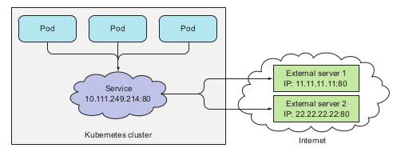

    pods utilizing a service with two external endpoints

- Creating alias for external service

    ```yaml
    apiVersion: v1
    kind: Service
    metadata:
      name: external-service
    spec:
      type: ExternalName                         #service type is ExternalName
      externalName: someapi.somecompany.com      #this is the domain of external service
      ports:
      - port: 80
    ```

    By creating the alias to the external service with specific domain, the pods utilizing the service can connect to the external api service through the `external-service.default.svc.cluster.local` domain name and not allowed the pods to know the actual service and domain name.

### Exposing service to external client

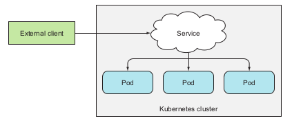

3 ways for exposing service to clients: 

- NodePort service
- Load balancer
- Ingress

**NodePort Service**

This method exposing a port on every nodes that has the pods belongs to the service. To create a NodePort service developers defined the yaml file:

```yaml
apiVersion: v1
kind: Service
metadata:
  name: kubia-nodeport
spec:
  type: NodePort     #type of this service is NodePort, 
                     #by default the type is ClusterIP
  ports:
  - port: 80
    targetPort: 8080
    nodePort: 30123
  selector:
    app: kubia
```

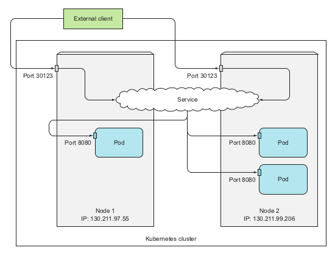

Sometimes to utilize the node port service, developers may configure the firewall setting on the host that the nodes runs on, like GCP or AWS.

**Load balancer service**

This type utilize the load balancing technology from the cloud providers that the Kubernetes cluster runs on. 

To create a LoadBalance service:

```yaml
apiVersion: v1
kind: Service
metadata:
name: kubia-loadbalancer
spec:
type: LoadBalancer
ports:
- port: 80
targetPort: 8080
selector:
app: kubia
```

When we get the service name `kubia-loadbalancer` we will see the external IP that the cloud providers provide to this service, and external client can connect to that service through this IP.

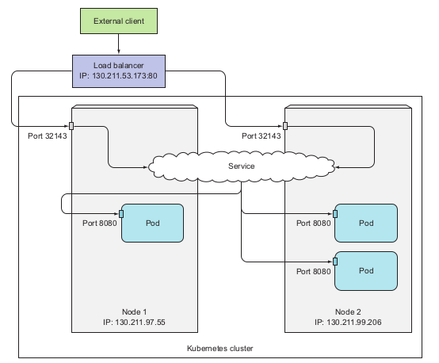

**Note for this 2 type of service**

- randomly chosen may choose the pods that not on the nodes receiving request.
- non-preservation of client's IP

### Ingress

An application layer resources that stores the defined path to the service below, external client will connect to each service through this path. 

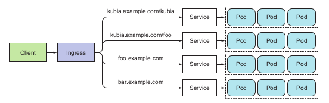

Note: Check whether the Kubernetes environments support Ingress controller before using Ingress. E.g *minikube* does not enable Ingress by default and required manual configuration.

**Creating an Ingress**

```yaml
apiVersion: extensions/v1beta1
kind: Ingress
metadata:
  name: kubia
spec:
  rules:
  - host: kubia.example.com
    http:
      paths:
      - path: /kubia
        backend:
          serviceName: {service_name}
          servicePort: 80
      - path: /foo
        backend:
          serviceName: {service_name}
          servicePort: 80
```

Ingress mechanism might be illustrated as follows:

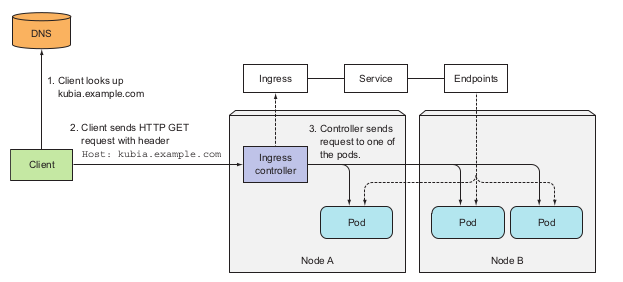

**Handle TLS traffic**

In order to handle HTTPS traffic to the Ingress, developers need to generate the pair of public-secrete keys for the Ingress using, e.g using openssl. These two values will be stored inside a Kubernetes resources called Secret.

```bash
$ openssl genrsa -out tls.key 2048
$ openssl req -new -x509 -key tls.key -out tls.cert -days 360 -subj
```

After generate key developers will create a Secret from the keys:

```bash
$ kubectl create secret tls-create --cert=tls.cert --key=tls.key
```

### Pods status for receiving the request

**Readiness probes**

→ Usage: specify pods status whether it is ready to receive request or not.

 3 types:

- *Exec* probe
- HTTP GET probe
- TCP socket probe

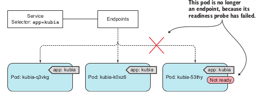

## Volumes

Volume is basically like the storage of any data that have been crud inside the pod by any container that ever existed or run in that pod. The volume is created and share its life cycle with the pod. which means it will be created when the pod is started and killed and the pod is deleted. By this mechanism the data inside the volume will be persisted across the container inside that pod. After a container is restarted, the new container can see all the files that were written to the volume by the previous container.

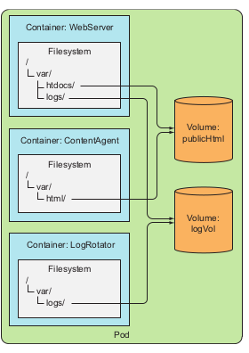

Types of volumes:

- emptyDir: simple empty directory used for transient data
- hostPath: used for mounting directories from worker nodes filesystem to pods
- gitRepo: volume initialize by checking out the contents of a Git repo
- nfs: NFS share mounted into pods
- gcePersistentDisk (Google Compute Engine Persistent Disk), awsElastic-BlockStore (AWS elastic block store volume), azureDisk (Microsoft Azure Disk volume): mounting cloud provider specific storage
- cinder,cephfs, iscsi, flocker, glusterfs, quobyte, flexVolume, vsphere-Volume, photonPersistentDisk,  scaleIO: used for mounting other types of network storage
- configMap, secret, downloadAPI: special types of volumes used to expose certain Kubernetes resources and cluster information to the pod

## Deployments

A high level resource that support deploying applications and updating applications declaratively. 

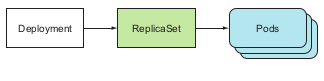

## StatefulSets

A workload API object that manages stateful application.

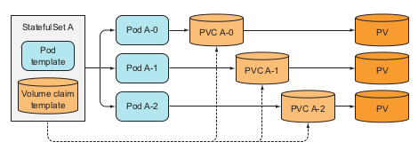

## API group and API version

link: [https://kubernetes.io/docs/reference/using-api/](https://kubernetes.io/docs/reference/using-api/)

# Reference

Kubernetes in Action 1st edition, Marko Luska - 2018